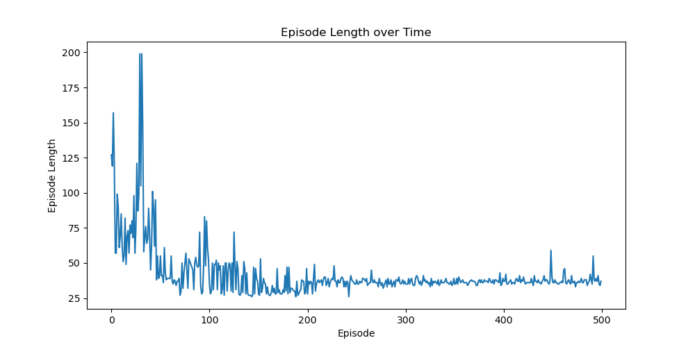
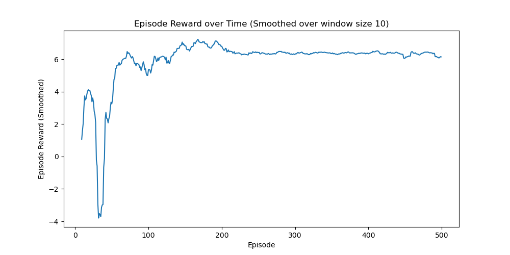
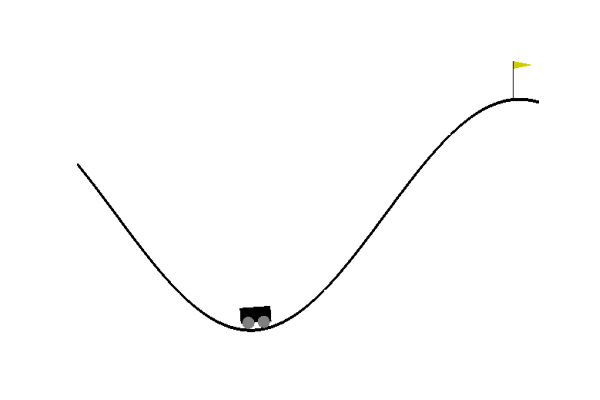
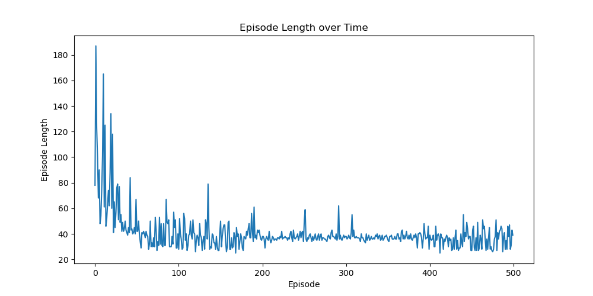
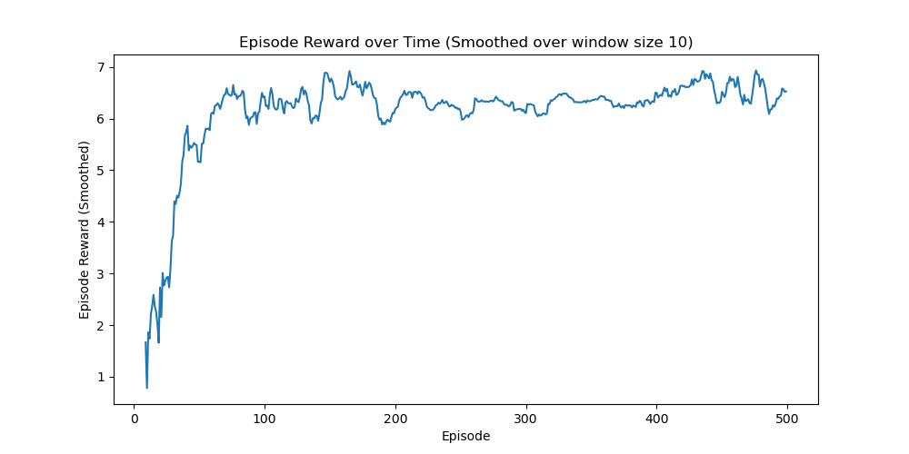
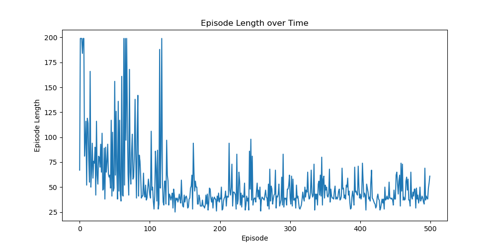
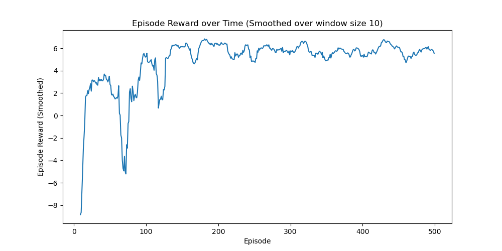
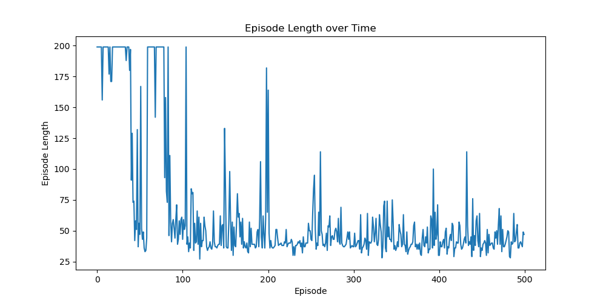
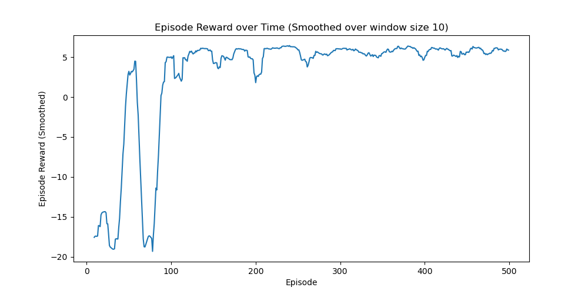

# Exercise 08 - DQN and Double-Q Learning

## DQN with Replay Buffer

### Variation 1: DQN with Soft Update (tau=0.01)

### Variation 2: DQN with Hard Update (cycle=10)

### Variation 3: Double-Q (also with Replay Buffer)

With greedy Q value from `Q_target`:

## Conclusion

For this experiment the DQN with hard update has the fastest learning speed and less vibration on the reward curve.

All 3 variations are able to achieve a relatively good learning result of ~6.5 for reward.

For Double-Q, if we use the target Q network to calculate the best action `a_next_best` from the next
state (similar to DQN), the final reward will be lower than the one with `a_next_best` calculated from the current Q
network (ref. `q_learning_fa.py:241`).
